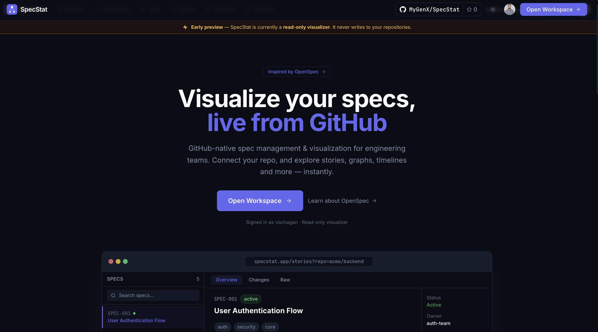
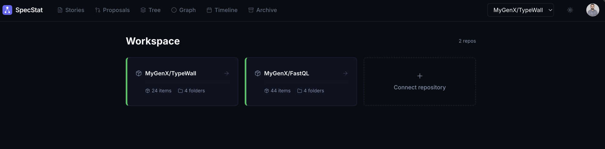
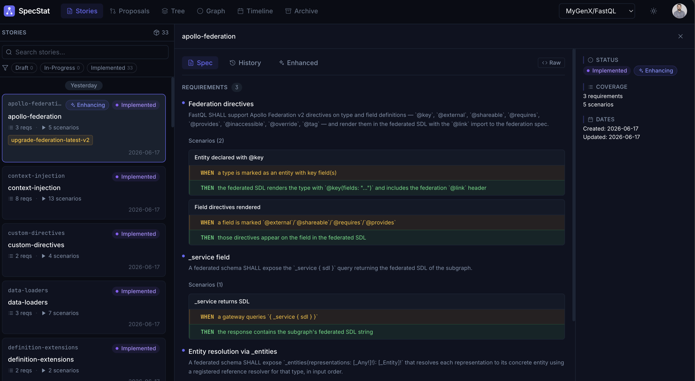
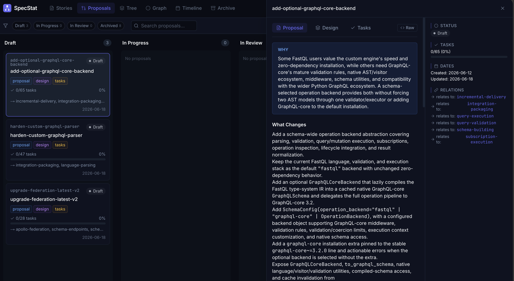
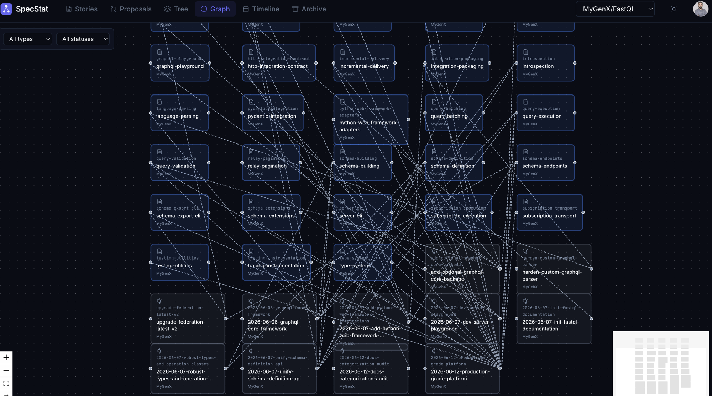
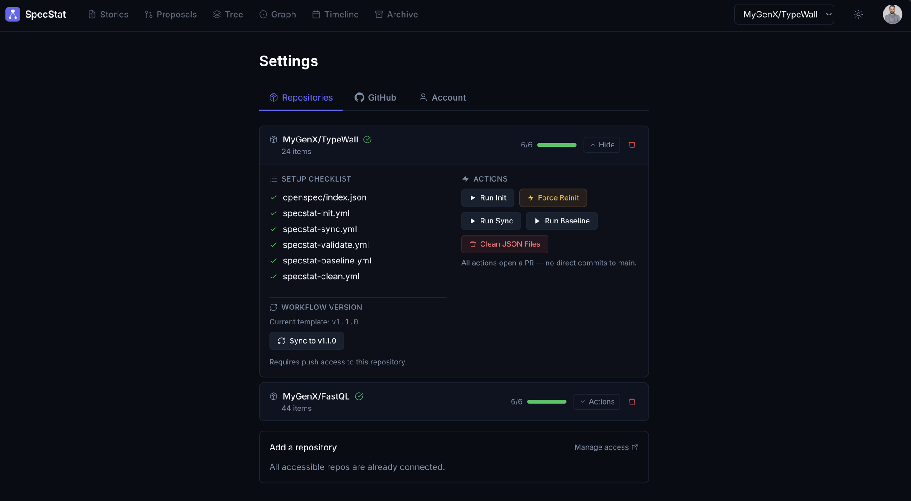

<div align="center">


### Visualize your specs, live from GitHub

GitHub-native spec management & visualization for engineering teams.
Connect your repo, and explore stories, graphs, timelines and more — instantly.

[](#license)
[](https://nextjs.org/)
[](https://www.typescriptlang.org/)
[](https://turbo.build/)
[](#-github-action)
[](#)

⚡ **Early preview** — SpecStat is currently a **read-only visualizer**. It never writes to your repositories.

<sub>Inspired by <a href="https://github.com/Fission-AI/OpenSpec">OpenSpec</a>.</sub>

</div>

---

## Overview

**SpecStat** is a GitHub-native, frontend-only specification management and
visualization tool built around the [OpenSpec](https://github.com/Fission-AI/OpenSpec)
convention. It requires **zero backend infrastructure and zero database** — GitHub
is the only backend.

Every spec item owns its own `visualize.json` metadata file and a root
`openspec/index.json` acts as a lightweight manifest. SpecStat reads these files
directly from GitHub and renders your specs, implementations, tasks, designs, and
proposals as Jira-like cards, relationship graphs, folder trees, and timelines.

### Why SpecStat

- 🐙 **GitHub is the only backend** — no custom server, no database.
- ✋ **Your OpenSpec files are never modified** — SpecStat is purely additive (it only adds `visualize.json` alongside your specs).
- ⚙️ **GitHub Actions do the heavy lifting** — parsing and indexing happen in CI, not in your browser.
- 🧩 **Works with any repo** — spec-only or mixed spec + code.
- 🚀 **Lazy loading everywhere** — only fetches what each view needs.

---

## ✨ Feature tour

> **Landing** — sign in with GitHub and open your workspace.



> **Workspace** — every connected repo at a glance, with item and folder counts.



> **Stories** — browse spec items with requirements, scenarios, coverage, history, and AI-enhanced views.



> **Proposals** — a Kanban board of change proposals (Draft → In Progress → In Review → Archived) with linked design, tasks, and relations.



> **Graph** — an interactive relationship map of every spec item and its connections.



> **Settings** — per-repo setup checklist, workflow version, and one-click actions (all open a PR — no direct commits to `main`).



---

## 🗂️ Views

| View | What it shows |
| --- | --- |
| **Stories** | Spec items with requirements, scenarios, coverage and commit history. |
| **Proposals** | Kanban board of change proposals grouped by status, with design & tasks. |
| **Tree** | The `openspec/` folder hierarchy. |
| **Graph** | Relationship map of all `relations` between items. |
| **Timeline** | Commit history for all spec files, with baseline markers. |
| **Archive** | Items marked `archived: true`. |

---

## ⚙️ How it works

```text
                 reads (Octokit)          generates (GitHub Action)
  ┌────────────┐ ───────────────▶ ┌──────────────────┐ ◀─────────────── ┌──────────────┐
  │  SpecStat  │                  │   Your GitHub     │                  │ SpecStat     │
  │  web app   │ ◀─────────────── │   repository      │ ───────────────▶ │ Action (CI)  │
  └────────────┘  index.json +    │  openspec/        │  visualize.json  └──────────────┘
                  visualize.json   │   index.json      │   + index.json
                                   │   specs/…         │
                                   └──────────────────┘
```

1. You add the SpecStat workflows to your repo (see [`actions/`](actions)).
2. The **Action** walks your `openspec/` directory, generates a `visualize.json`
   next to every item and folder, and writes a root `openspec/index.json` manifest.
3. The **web app** reads `index.json` first, then lazily fetches per-item data and
   renders the views above.

The only hard convention is `openspec/index.json` at the repo root — see
[Repository Conventions](docs/repo-conventions.md).

---

## 📦 Monorepo layout

SpecStat is a [Turborepo](https://turbo.build/) monorepo using npm workspaces.

```text
SpecStat/
├── apps/
│   └── web/                  # Next.js 14 app — the SpecStat UI
├── packages/
│   ├── types/                # Shared domain types (visualize.json, index.json)
│   ├── openspec-parser/      # Pure parsing & validation (Zod) of OpenSpec files
│   ├── github-client/        # Octokit reads, action triggers, workflow setup
│   └── openspec-action/      # The GitHub Action runtime (init/sync/validate/…)
├── actions/                  # Copy-paste workflow templates for your repo
├── action.yml                # Published GitHub Action definition
└── docs/                     # Guides & conventions
```

| Package | Description | Docs |
| --- | --- | --- |
| [`@specstat/web`](apps/web/README.md) | Next.js 14 App Router UI (board, graph, tree, timeline). | [README](apps/web/README.md) |
| [`@specstat/types`](packages/types/README.md) | Shared TypeScript domain model. | [README](packages/types/README.md) |
| [`@specstat/openspec-parser`](packages/openspec-parser/README.md) | Parses & validates OpenSpec/`visualize.json` files. | [README](packages/openspec-parser/README.md) |
| [`@specstat/github-client`](packages/github-client/README.md) | GitHub read client + action triggers + workflow setup. | [README](packages/github-client/README.md) |
| [`@specstat/openspec-action`](packages/openspec-action/README.md) | The Node20 GitHub Action runtime. | [README](packages/openspec-action/README.md) |

---

## 🚀 Quick start (local development)

**Prerequisites:** Node.js 20+, npm 10+.

```bash
# 1. Install dependencies for the whole workspace
npm install

# 2. Configure the web app environment
#    Create apps/web/.env.local with your GitHub OAuth app credentials:
#      AUTH_GITHUB_ID=...
#      AUTH_GITHUB_SECRET=...
#      AUTH_SECRET=...            # `openssl rand -base64 32`
#      NEXTAUTH_URL=http://localhost:3000

# 3. Run the dev server (Turborepo runs the web app)
npm run dev
```

Then open <http://localhost:3000> and sign in with GitHub.

| Script | Action |
| --- | --- |
| `npm run dev` | Start the web app in dev mode. |
| `npm run build` | Build all workspaces. |
| `npm run lint` | Lint all workspaces. |
| `npm run type-check` | Type-check all workspaces. |

For the hosted onboarding flow, see [Getting Started](docs/getting-started.md).

---

## 🤖 GitHub Action

SpecStat ships a Node20 GitHub Action (see [`action.yml`](action.yml)) that does all
parsing and indexing in CI. Add it to a workflow in your repo:

```yaml
- uses: MyGenX/SpecStat@v1
  with:
    mode: sync                     # init | sync | validate | baseline | process-triggers | pr-comment
    root: openspec                 # OpenSpec root folder (default: openspec)
    github_token: ${{ secrets.GITHUB_TOKEN }}
```

| Mode | Purpose |
| --- | --- |
| `init` | Walk `openspec/`, generate all `visualize.json` files + `index.json`. |
| `sync` | Re-index on every push that touches `openspec/`; process markdown triggers. |
| `validate` | Validate items against schema / custom rules. |
| `baseline` | Create a named snapshot of the current spec state. |
| `process-triggers` | Run `@visualizer:trigger` directives found in spec markdown. |
| `pr-comment` | Post a validation/summary comment on the PR. |

Ready-to-copy workflow templates live in [`actions/`](actions)
(`specstat-init`, `-sync`, `-validate`, `-baseline`, `-clean`). Spec markdown can
also embed automation directives — see [Markdown Triggers](docs/markdown-triggers.md).

---

## 🧱 Tech stack

| Area | Technology |
| --- | --- |
| Framework | Next.js 14 (App Router), React 18 |
| Auth | NextAuth v5 (GitHub OAuth) |
| Data | TanStack Query, TanStack Virtual |
| Graph | React Flow |
| Board | dnd-kit |
| Markdown | react-markdown, remark-gfm, rehype-highlight/sanitize |
| GitHub | Octokit REST |
| Validation | Zod |
| Styling | Tailwind CSS |
| Tooling | Turborepo, TypeScript 5, esbuild |

---

## 🏷️ Reference

**Statuses** (`SpecStatus`): `draft` · `in-progress` · `in-review` · `approved` · `implemented` · `deprecated` · `archived`

**Item types** (`SpecType`): `spec` · `impl` · `task` · `design` · `proposal` · `decision` · `component` · `domain`

Full data model: [`@specstat/types`](packages/types/README.md) ·
JSON schema details: [visualize.json schema](docs/visualize-json-schema.md).

---

## 📚 Documentation

- [Getting Started](docs/getting-started.md)
- [Repository Conventions](docs/repo-conventions.md)
- [Markdown Triggers](docs/markdown-triggers.md)
- [visualize.json Schema](docs/visualize-json-schema.md)

---

## License

MIT.
